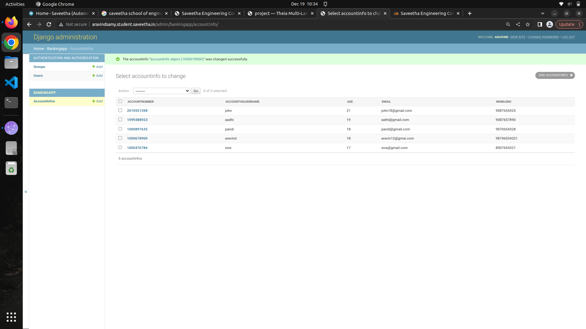

# Django ORM Web Application

## AIM
To develop a Django application to store and retrieve data from a database using Object Relational Mapping(ORM).

## Entity Relationship Diagram


## DESIGN STEPS

### STEP 1:
An Django application is created inside dataproject folder.


### STEP 2:
A python program is written to create a table to store and retrieve data.


### STEP 3:
The table is created with 6 fields in which the username field is made as PrimaryKey.

### STEP 4:
Then the project files migrated. A superuser is also created.
### STEP 5:
Now the server side program is executed .
### STEP 6:
The admin page of our website is accessed using username and password.
### STEP 7:
Records are added and saved in the table inside the database.


## PROGRAM
```
from django.db import models
from django.contrib import admin
# Create your models here.

class accountinfo(models.Model):
    accountnumber = models.CharField(max_length=10,help_text='Your account Number',primary_key=True)
    accountholdername = models.CharField(max_length=100)
    age = models.IntegerField()
    email = models.EmailField()
    mobileno = models.IntegerField()

class accountAdmin(admin.ModelAdmin):
   list_display = ('accountnumber','accountholdername','age','email','mobileno')
   
   ```

## OUTPUT



## RESULT
Thus a Django application is successfully developed to store and retrieve data from a database using Object Relational Mapping(ORM).

